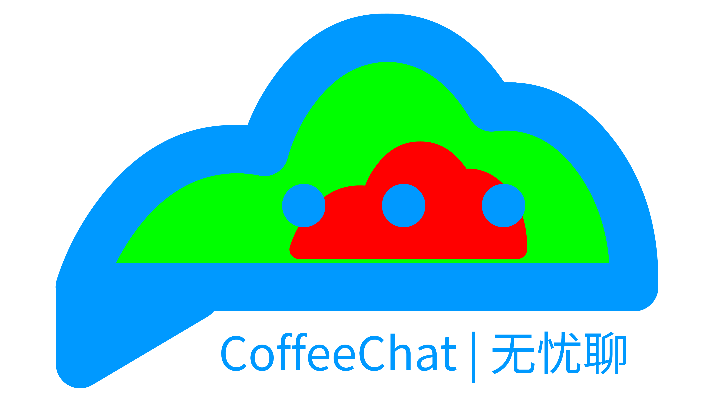

<div align="center">
  
</div>

<div align="center">

# 无忧聊 - Minecraft 聊天增强模组


[](https://opensource.org/licenses/MIT)
[](https://neoforged.net/)
[](https://www.minecraft.net/)
[](https://adoptium.net/)

<br>一个基于NeoForge的Minecraft聊天增强模组，为玩家提供更专业、更完善的IRC聊天系统体验。
</div>

## 🎈介绍
无忧聊Minecraft(以下简称无忧聊)增强了原版Minecraft聊天系统，为玩家提供更专业、更完善的IRC聊天系统体验。<br>
提供了一些 api，让玩家可以自定义聊天系统、外接程序提供功能。<br>
提供独立IRC系统，禁用原版Minecraft聊天。

## 📦 安装说明

### 系统要求
- **Minecraft版本**: 1.21.11
- **模组加载器**: NeoForge 21.11.38-beta
- **Java版本**: JDK 25
- **语言级别**: Java 25
- 推荐1700MB的游戏运行内存空间

### 编译方法

```bash
# Windows
.\gradlew build

# Linux/macOS
./gradlew build
```

编译完成后，在 `build/libs/` 目录下可以找到生成的jar文件。

### 安装步骤
1. 下载并安装 NeoForge 21.11.38-beta
2. 将编译好的jar文件放入 `.minecraft/mods` 文件夹
3. 启动游戏即可使用

## 📚 文档

开发者可以在 [`docs`](docs/) 文件夹中查看详细的开发文档和API说明。

## 🤝 贡献指南

我们欢迎任何形式的贡献！请查看详细的 [贡献规范](CONTRIBUTING.md) 了解完整的提交和PR规范。

### 快速开始

1. **Fork项目** 到你的GitHub账户
2. **克隆到本地**：
   ```bash
   git clone https://github.com/yourusername/coffeechat.git
   cd coffeechat
   ```
3. **创建功能分支**：
   ```bash
   git checkout -b feature/your-feature-name
   ```
4. **进行开发** 并遵循 [贡献规范](CONTRIBUTING.md)
5. **提交更改** 并推送
6. **创建Pull Request"

### 文档说明

- **外部贡献文档**：位于源代码根目录（如本README、CONTRIBUTING.md等）
- **内部开发文档**：请写入 [`docs/`](docs/) 文件夹内

### 代码规范
- 使用Java 25语法特性
- 遵循NeoForge开发最佳实践
- 确保良好的代码文档和注释

## 📄 许可证与遵循协议

本项目采用 **MIT许可证**，详情请参见 [LICENSE](LICENSE) 文件。

```
MIT License

Copyright (c) 2026 Deplayer

Permission is hereby granted, free of charge, to any person obtaining a copy
of this software and associated documentation files (the "Software"), to deal
in the Software without restriction, including without limitation the rights
to use, copy, modify, merge, publish, distribute, sublicense, and/or sell
copies of the Software, and to permit persons to whom the Software is
furnished to do so, subject to the following conditions:

The above copyright notice and this permission notice shall be included in all
copies or substantial portions of the Software.
```

并且，本模组严格遵守 [Minecraft最终用户许可协议(EULA)](https://account.mojang.com/documents/minecraft_eula)。

## 📞 联系方式

- **作者**: Deplayer
- **邮箱**: deplayer515@hotmail.com
- **GitHub Issues**: [提交问题报告](https://github.com/deplayeris/coffeechat/issues)

## 🙏 致谢

感谢所有为这个项目做出贡献的开发者、Fabric开发组、社区教程大佬、使用者们！

---