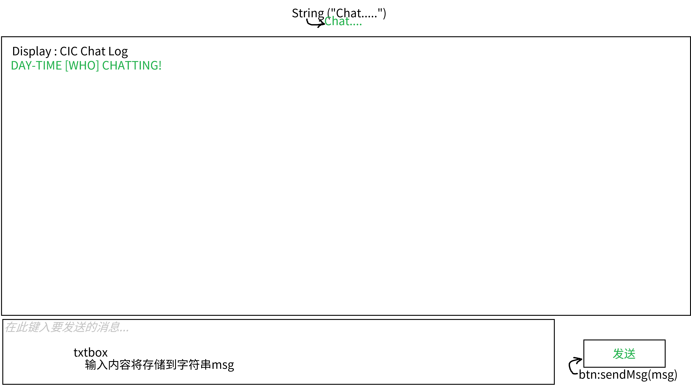

## 计划创建一个屏幕，backcolor黑灰色。
> 这个屏幕是用于聊天屏幕的，用于将CIC客户端核心的sendMessage方法和推送服务处理器和一些相关代码使用映射到UX交互


打开的方式是默认按F6<br>
直接按照 nf 官方文档说的继承 Screen class：
```java
//附件1
public class MyScreen extends Screen {
    protected void init() { // 窗口大小变化时可以用这里来重调用
        addRenderableWidget(new Button( something... )); // 这里添加的是一些交互和渲染组件
    };

    public void render(GuiGraphics g, int mx, int my, float pt) {
        super.render(g, mx, my, pt); // 先渲染背景或者部件
        g.setTooltipForNextFrame( somethings ); // 工具提示延迟到新层渲染
    };
};
```
这只是创建一个基础屏幕，如果创建一个容器屏幕的话，就会简单很多。<br>
就只用考虑:<br>
`renderBg()`：绘制背景纹理 //（用 leftPos不得不topPos 定位）<br>
`renderLabels()`：绘制标题或者库存标签 // （坐标已相对化）<br>
`containerTick()`：容器的动态专门逻辑 // （如进度条更新）

